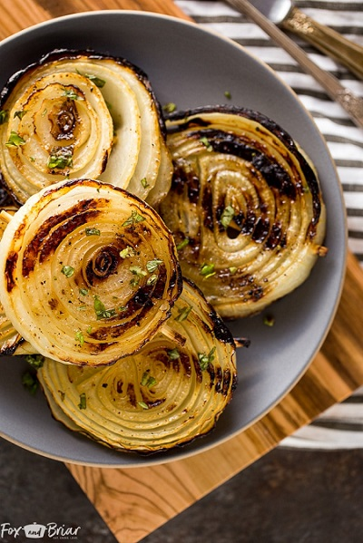

## Grilled Onions

[Original Recipe from Fox and Briar](https://www.foxandbriar.com/best-ever-grilled-onions/)

** Total time: 40 minutes || Serving: 4 **

### Ingredients

- 2 sweet onions, such as Walla Walla or Vidalia
- 1 tablespoon olive oil
- kosher salt
- fresh ground pepper

### Instructions

1. Hold the onion on a cutting board, with the root end facing sideways. About 3/4 of an inch in from the root, drive a wooden skewer through the center of the onion. Push the skewer all the way through, so that the flat end of the skewer is next to the onion and the pointy end is as far away from the onion as possible.
   On one side of the skewer, slice the root end off of the onion. On the other side of the skewer, leaving about 3/4 inch of onion, slice the onion so that the skewer is going through the center of the slice.
2. Use a knife to cut the part of the skewer that is sticking out of the onion.  
3. Repeat until both onions have been sliced into even slices, about 3/4 inch thick.  Trim the skewers so that there is not excess sticking out of the onion.
4. Brush the slices on both sides with olive oil, season with salt and pepper.

#### - On a charcoal grill:
1. Make a two zone fire - coals on one side and no coals on the other.
2. Place the onions on the cool side of the grill and flip and roate every 10 to 15 minutes until they are golden brown.  
3. Onions are done when golden and tender (in about 25-40 minutes)

#### - On a gas grill:
1. Heat the grill for 5-10 minutes.
2. Lower the burners to low and cook the onions on the low burner, flipping every 10 minutes. 
3.  Onions are done when golden and tender (about 25-40 minutes).

** Notes:**

* Use sweet onions such as Walla Walla or Vidalia.  The sugars in the onion caramelize perfectly.
* Use wooden skewers.  They can be cut to fit the onion, so each onion is skewerd individually.
* Running the skewer through the center of the onion will keep the tender, middle part of the onion (the best part!) from falling out through the grates.
* Cook low and slow.  If you use high heat the outside of the onion will burn while the inside will be underdone.
* Slice onions into even slices to ensure even cooking.
