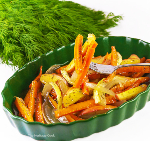

## Harvest Maple Carrots and Apples

[Original Recipe](https://theheritagecook.com/harvest-maple-carrots-apples-recipe-gluten-free/)

** Prep time: 15 minutes || Cook time: 40-60 minutes || Serving: 4 || Rating 10/10 **

### Ingredients

- 8-10 large carrots, cut lenghtwise all about the same size and thickness
- 1 medium onion, cut lenghtwise into thin wedges; about same size and thickness
- 1/4 cup orange juice
- 1 tablespoon minced fresh dill weed, to taste
- salt and black pepper, to taste
- 3 medium-tart apples, such as Gala, cut into thin wedge
- 3 tablespoons pure maple syrup
- olive oil

### Instructions

1. Preheat the oven to 350°F. Pour oil into a small bowl and lightly brush two shallow au gratin dishes with about 1 teaspoon of the olive oil each.
2. Lightly coat the shallow cooking dish with olive oil and mix in the carrots and onions. 
3. Add the orange juice to the dish, brush with the oil, sprinkle with dill, and season with salt and pepper. 
4. Place, uncovered, and bake for 20 to 30 minutes.
5. Remove the pan from the oven and add the apples, interspersing them with the vegetables. Drizzle with the maple syrup. 
6. Return to the oven and continue baking for an additional 20 to 30 minutes or until golden brown and slightly crispy at the edges. 
7. Adjust seasoning if desired.

To Serve: Transfer the dish to serving plates and drizzle with a little of the pan juices. Sprinkle with a little more of the dill if desired.
