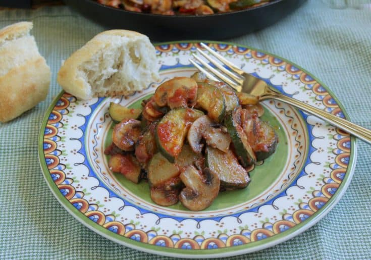

## Italian Style Zucchini and Mushrooms

[Original Recipe by Christinna Conte](https://www.christinascucina.com/italian-style-zucchini-and-mushrooms/)

** Prep time: 5 minutes || Cook time: 18 minutes || Total time: 23 minutes || Serving: 4 || Rating X/10 **

### Ingredients

- Kosher salt (optional)
- 4 tablespoon extra virgin olive oil
- 1 lb, about 1 large or 2 medium sized zucchini (green and/or yellow)/courgettes 
- 8 oz of mushrooms, sautéed in olive oil with a clove of garlic
- 2 medium sized tomatoes (preferably Roma) diced or about 4 oz (1/2 cup) good quality passata like Mutti
- salt and black pepper (hot pepper is very good in this dish, too)

### Instructions

1. Slice the zucchini in half lengthwise and then cut into slices. 
2. Heat 2 tablespoons of the oil in a frying pan over medium high heat, then add the garlic and mushrooms. Sauté for about 6 to 8 minutes, sprinkle with a little salt and remove. Put the mushrooms in a plate or bowl and set aside.
3. Add the other 2 tablesppons of the oil and the sliced zucchini. Sauté  and stir frequently, for about 10 minutes. 
4. When the zucchini begin to show tinges of  brown, add the sautéed mushrooms. Keep the pan on the heat.
5. Add the diced tomatoes or puree (move the zucchini to one side and turn the heat up a little to cook the tomatoes a bit before mixing them through) and continue to sauté, turning occasionally. 
6. Add salt and pepper. Taste, and add more salt if it's a bit bland. This dish is very flavorful.
7. Continue to cook for a few more minutes, then remove from heat. 

This makes a nice, light summer lunch, or a tasty side dish, along with some crusty bread!

Notes: If you like your zucchini with a little more bite, just place the cut pieces into a colander and lightly sprinkle with Kosher salt. Toss it around so it has salt all over, and let drain for about 20 minutes.
