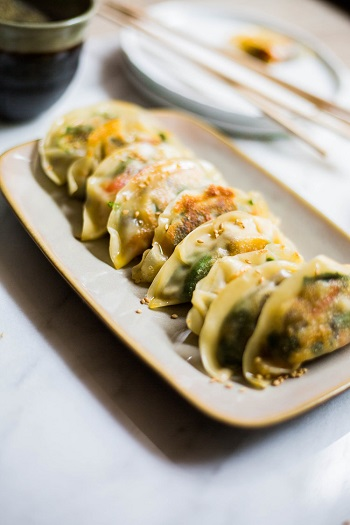

## Mushroom Spinach Potstickers

[Original Recipe by Pure Mamas](https://www.puremamas.com/blog_all/2017/delicious-mushroom-spinach-potstickers)

** Prep time: 15 minutes || Cook time: 10 minutes || Total time: 25 || Yield: 12 **

### Ingredients

- 3.5 oz mushrooms finely chopped (about 2 cups)
- 1-2 red/orange bell peppers, finely chopped
- 3 small cloves garlic or 1 large one, pressed or chopped
- 2 Tbsp toasted sesame oil or butter (separate)
- 1 Tbsp shallots, finely chopped
- 1 cup fresh spinach, chopped 
- pinch sea salt
- 1 package of potsticker or gyoza wrappers (or home-made potsticker wrappers recipe below)
- glass of water to dip your fingers in
- dipping sauce (recipe below)

### Instructions

1. In a large frying pan add 1 Tbsp oil (save the other Tbsp for later), mushrooms, bell peppers, garlic and sea salt. Cook this mixture for about 5 minutes. 
2. Once veggies are done, stir in the spinach so that it wilts. Mix well. Remove the filling from heat and put it in a bowl.
3. To fill the potstickers: wet your finger and wet the side of the round wrappers. Scoop about 1 tsp or so of mixture onto the center of the wrapper. 
4. Fold the round wrapper over, making it a half circle. Wet your fingers well and press the open edges of the half circle together well.
6. Using the rest of oil, heat the pan on medium and cook it until lightly brown. Flipping over a few times. About 4 total minutes.
7. Serve with a dipping sauce.

### Dipping sauce

- Soy sauce or coconut aminos or Tamari (Gluten-free)
- Rice wine vinegar 
- Maple syrup 
- Chili oil or Sriracha
- minced garlic cloves or garlic powder 
- sesame oil 

####

1. Mix all ingredients and enjoy. 

### Home-made Potsticker wrappers

[Original Recipe from The Flavor Bender](https://www.theflavorbender.com/perfect-potstickers-dumpling-dough/#wprm-recipe-container-20628)

- 285g of all purpose Flour
- 150-175 ml of boiled water (see note 1 & 2)
- 1 tsp salt

#### Instructions

1. In a bowl, mix the flour and salt together.
2. Create a well in the middle (like you would when making pasta)
3. Add hot water slowly, while mixing with a wooden spoon until flour forms clumpy bits. You can alternate mixing and pouring water.
4. Knead the dough clumps by hand to form one soft dough ball. If the mix is too dry, add a little more of the water at a time. If the mix is too sticky, add a little flour at a time.
5. Knead the dough further on the work bench for about 2 minutes. Use flour sparingly if the dough is getting sticky. The dough will look smooth at this stage and be a little stretchy/elastic.
6. You can let the dough rest like this in one big ball, or cut it roughly into four equal parts and knead each piece to form a dough ball.
7. Wrap the dough/dough balls tightly in plastic wrap (individually) or place it inside a zip-lock bag and seal it (push out as much air as possible) and let it rest for at least 1 hour or up to 2 hours.
8. You can use the dough immediately after it has been rested.
    - If you are using it the next day instead, place the dough in the fridge (sealed in bags) and return it back to room temperature before handling them.
9. Lightly dust your work bench and rolling pin with flour.
10. Roll out each piece of the dough (dusting lightly with flour as needed) as thin as you can.
12. Once the dough has been rolled out, (make sure the dough is not sticking to the counter top), cut out the dumpling wrappers using a round biscuit cutter of 3.5-4 inches in diameter.
    - Re-knead the leftover dough and re-roll it once more (after resting it for 30 minutes at least) to cut out more dumpling wrappers.
14. Use them immediately with your choice of filling.

#### Notes

1. The amount of water changes depending on the brand of the flour and the temperature. Keep an eye out for the right consistency. The common amount of flour to water ratio is roughly 2:1

2. Boil the water first, and then measure the required amount of water. Do not measure water first and then boil it, as evaporation = less water!

3. If you are stacking the wrappers after cutting them out, they will require flour between each one to prevent sticking. 
