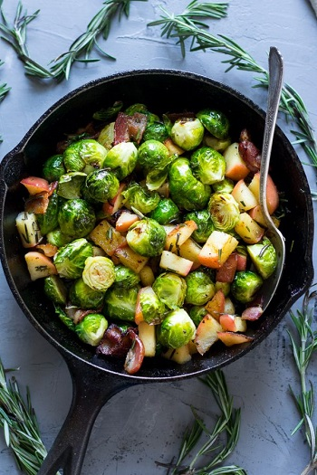

## Roasted Brussels Sprouts with Bacon and Apples

[Original Recipe by Michele from Paleo Running Momma](https://www.paleorunningmomma.com/paleo-roasted-brussels-sprouts-whole30/)

** Prep time: 5 minutes || Cook time: 20 minutes || Total time: 25 minutes || Serving: 4 **

### Ingredients

- 1 lb brussels sprouts, tops removed and cut in half(to ensure even cooking, they should be uniform in size)
- 2 tsp olive oil
- 1 apple, chopped into 1/2-1 inch cubes
- 4-6 bacon, cut into 1 inch pieces
- 1 Tbsp fresh rosemary finely chopped
- salt and pepper to taste

### Instructions

1. Preheat your oven to 400 degrees
2. Toss the brussel sprouts with olive oil + salt. Roast until they're browning and fork tender (about 20 minutes).
3. Over medium-high heat, cook the bacon pieces until about 3/4 of the way done 
4. Add the apples and rosemary. cook and stir until the apples have softened and the bacon is fully cooked. Remove from heat.
5. Once brussels sprouts are done, add them to the skillet and toss to combine all the flavors. Sprinkle with more salt and pepper. 

Can be served as a side dish or over breakfast with eggs.
