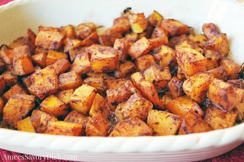

## Roasted Butternut Squash

[Original Recipe by Amee Livingston](https://ameessavorydish.com/roasted-butternut-squash/)

** Prep time: 10 minutes || Cook time: 1 hour || Serving: 6-8 **

### Ingredients

- 1 or half a butternut squash (cut into cubes)
- 3 tablespoons of oil (coconut or olive etc.)
- 1 tablespoon of cinnamon
- 1/2 tablespoon sea salt

### Instructions

1. Preheat oven to 400 F
2. In a large bowl, mix in the oil, cinnamon and sea salt.
3. Add the squash and toss until fully coated
4. Spread the coated squash in a large baking dish and bake for 45 minutes to an hour.

_Tags: vegan, gluten-free, paleo, dairy-free, north american, 1 hour, sides_