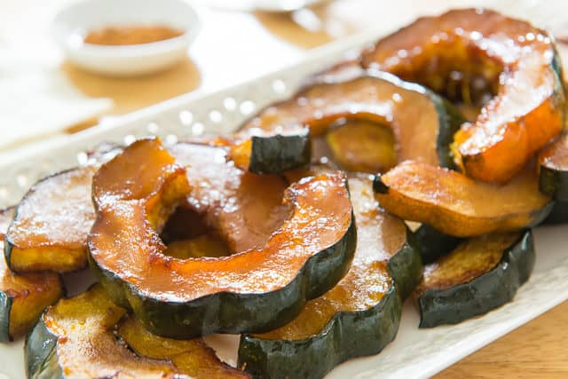

## Roasted Maple Squash

[Original Recipe Joanne](https://www.fifteenspatulas.com/maple-butter-roasted-acorn-squash/)

** Prep time: 10 minutes || Cook time: 30 hour || Total time: 40 minutes || Serving: 4 **

### Ingredients

- 2 acorn squash or other type of squash
- 1/4 cup pure maple syrup
- 3 tbsp olive oil (or coconut oil, unsalted butter etc.)
- 1/4 tsp ground cinnamon
- 1/8 tsp ground cloves
- 1/2 tsp salt

### Instructions

1. Preheat the oven to 375F.
2. Trim the top and bottom off each squash, then cut in half from top to bottom.
    - If you do not want to consume the skin, it is easier to peel it off right before eating, rather than trying to peel the acorn squash before baking.
3. Remove the inner seeds and strings.
4. Lay each acorn squash half on its flat side, and cut into 1-inch thick slices.
6. In a small bowl, mix together the maple syrup, oil, ground cinnamon, ground cloves and salt. 
7. Brush the maple mixture onto both sides of the squash.
8. Roast for 25 minutes on the first side, then flip each slice over and bake for another 15-20 minutes, until caramelized and soft. 

_Tags: vegan, gluten-free, paleo, dairy-free, north american, less than 1 hour, sides_