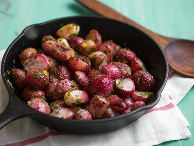

## Roasted Radishes

** Total time: about 30 min **

### Ingredients

- Radishes
- Olive oil
- Salt
- Pepper

### Instructions

1. Preheat oven to 400F. 
2. Cut the radishes into quarter or halves.
2. Toss radishes with olive oil, salt and pepper.
3. Spread on baking sheet and sprinkle with salt.
4. Roast them face down to brown them.
5. When they are tender crips Check if they are ready to your liking (Takes between 15 minute to 30 minutes, depend on their size).
