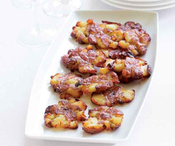

## Crispy Squished Baby Potatoes

** Total time: 40 minutes || Serving: 4 **

### Ingredients

- 12 small round potatoes
- olive oil
- dried rosemary
- salt and pepper
- add finely cut fresh herbs such as parsley (optional)

### Instructions

1. Boil the potatoes until soft (when you can pass your fork through, about 10-15 minutes).
2. Preheat the oven to 375F.
3. Drain, and place the potatoes on a baking sheet. 
3. Take a flat object such as a small plate and push downward on the potato to crush. 
4. Drizzle with olive oil, and liberally sprinkle salt, pepper and rosemary. 
5. Baked until the potatoes are golden brown and crispy (about 20-30 minutes). 

_Tags: vegan, gluten-free, dairy-free, north american, less than 1 hour, sides_
