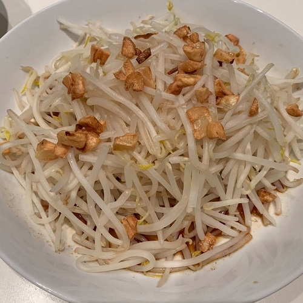

## Stir Fry Bean Sprouts

[Original Recipe from Nyonya Cooking](https://www.nyonyacooking.com/recipes/stir-fry-bean-sprouts-with-fried-garlic~SJxB_vswGq-m)

** Total time: 10 minutes || Serving: 4 **

### Ingredients

- 4 tbsp oil
- 2	garlic cloves
- 1 tbsp sugar (maple syrup)
- 4 tbsp soy sauce 
- 6 tbsp water
- ½ tsp	white pepper
- 800 mL water
- 800 g	bean sprouts

### Steps

1. Heat pan over medium heat. Add oil and allow it to heat up. Mince garlic and sauté them until golden brown. Remove fried garlic from oil to set aside.
2. Pour soy sauce, sugar, water and white pepper into a pan. Cook mixture over low heat until sugar dissolves. Set gravy aside.
3. Using the same pan, boil water to blanch bean sprouts for about 60 seconds. Drain the water out. 
4. In the frying pan, mix the sauce, fried garlic and bean sprout and fry for about minute or two.
