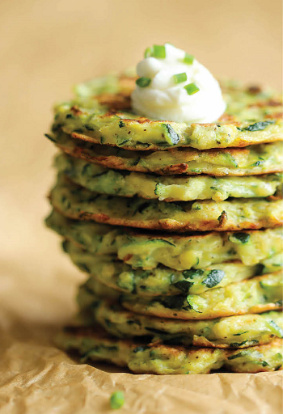

## Zucchini Fritters

[Original Recipe by Damn Delicious](https://damndelicious.net/2014/04/02/zucchini-fritters/)

** Prep time: 15 minutes || Cook time: 10 minutes || Total time: 25 || Serving: 4 **

### Ingredients

- 1 1/2 pounds zucchini, grated
- 1 teaspoon salt
- 1/4 cup all-purpose flour (or all-purpose gluten-free flour)
- 1/4 cup nutritional yeast (or parmesan if not dairy-free)
- 2 cloves garlic, minced
- 1 large egg, beaten
- Kosher salt and freshly ground black pepper, to taste
- 2 tablespoons olive oil

### Instructions

1. Place grated zucchini in a colander over the sink. Add salt and gently toss to combine; let sit for 10 minutes. Using a clean dish towel or cheese cloth, drain zucchini completely.
2. In a large bowl, combine zucchini, flour, nutritional yeast, garlic and egg; season with salt and pepper, to taste.
3. Heat olive oil in a large skillet over medium high heat. Scoop tablespoons of batter for each fritter, flattening with a spatula, and cook until the underside is nicely golden brown, about 2 minutes. Flip and cook on the other side, about 1-2 minutes longer.
4. Serve immediately.

_Tags: dairy-free, gluten-free, fried, sides_