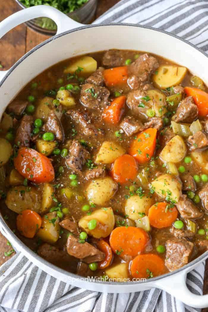

## Traditional Beef Stew

[Original Recipe by Holly Nilsson](https://www.spendwithpennies.com/beef-stew-recipe/)

** Prep time: 20 minutes || Cook time: 1h10 minutes || Serving: 8 || Rating 9.5/10 **

### Ingredients

- 2 pounds stewing beef, trimmed and cubed
- 3 tablespoons flour
- 1/2 teaspoon garlic powder
- 1/2  teaspoon salt
- 1/2 teaspoon black pepper
- 3 tablespoons olive oil
- 1 sweet onion, chopped
- 6 cups beef broth
- 1/2 cup red wine or sherry (optional)
- 1 pound potatoes, peeled and cubed
- 4 carrots, cut into 1 inch pieces
- 4 stalks celery, cut into 1 inch pieces
- 3 tablespoons tomato paste
- 1 teaspoon dried rosemary
- 2 tablespoons cornstarch
- 2 tablespoons water
- 3/4 cup peas

### Instructions

1. Combine flour, garlic powder and salt & pepper. Toss beef in flour mixture. 
2. Heat olive oil in a large Dutch oven or pot. Cook the beef and onions until browned.
3. Add beef broth and red wine while scraping up any brown bits in the pan.
4. Stir in all remaining ingredients except for peas, cornstarch and water. Reduce heat to medium low, cover and simmer 1 hour or until beef is tender (up to 90 minutes).
5. Mix equal parts cornstarch and water to create a slurry. Slowly add the slurry to the boiling stew to reach desired consistency (you may not need all of the slurry).  
6. Stir in peas and simmer 5-10 minutes before serving . Season with salt & pepper to taste.

** Notes **

Beef stew meat is often made from the ends of different cuts of beef. If your beef is not tender after 60 minutes, cover and allow to simmer an additional 15-20 minutes or until tender.
