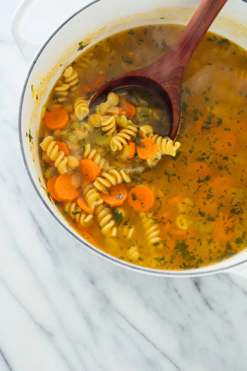

## Chickpea/Chicken Noodle Soup

[Original Recipe by Kate from Cookie and Kate](https://cookieandkate.com/chickpea-noodle-soup-recipe/)

** Prep time: 15 minutes || Cook time: 25 minutes || Serving: 6 || Rating 10/10 **

### Ingredients

- 1 can chickpeas, rinsed and drained, or 1 1/2 cups cooked chickpeas
	- if using chicken instead: 2 cooked chicken breasts, chopped
- Pasta (e.g. spiral, noodle soup, egg noodle), amount of your choice
- 1 medium yellow onion, diced
- 1 cup celery (about 2 long stalks), diced
- 1 cup carrots (2 medium or 4 small), diced
- 8 cups broth
- 2 tablespoons olive oil
- 1 bay leaf
- basil, to taste
- rosemary, to taste
- thyme, to taste
- salt and pepper, to taste

### Instructions

1. Warm the olive oil in a soup pot over medium heat. Once the oil is shimmering, add the onion, celery, and carrots. Cook, stirring often, until the onions are turning translucent (about 5 to 7 minutes).
2. Add the broth, the bay leaf, chickpeas, pasta, herbs, salt and pepper.
	- If using chicken insted of chickpeas, add cooked chopped chicken in the pot (The chicken may be bake or fried).
3. Raise the heat to high and bring the mixture to a simmer, then reduce heat to medium-low and continue simmering until the pasta is tender (about 10 to 20 minutes).
4. Remove the pot from the heat and adjust the seasoning to taste. 

Serve while hot. Excellent when feeling under the weather. 

### Note: 

You can substitute Great Northern beans for the chickpeas.
