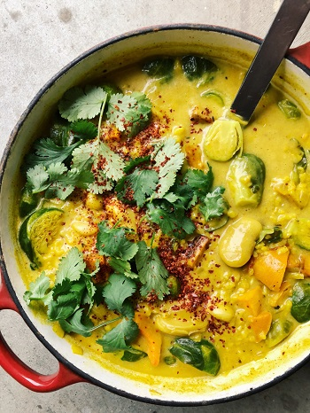

## Curried Bean and Brussels Stew with Roasted Squash

[Original Recipe by Amanda from Mama eats plants](https://mamaeatsplants.wordpress.com/2018/03/01/curried-bean-brussels-stew-with-roasted-squash/)

** Prep time: 10 minutes || Cook time: 1 hour || Total time: 1 hour and 15 minutes || Serving: 2-4 || Rating 10/10 **

### Ingredients

- 1 cup dried beans: adzuki, giant lima, or cannellini (giant) beans, soaked in water overnight
- 1 medium kabocha, kuri, or butternut squash, chopped into bite size pieces
- 1 pound halved brussel sprouts, hard ends cut away
- 1 large sweet onion, diced
- 2 to 3 garlic cloves, crushed
- 1 tablespoon finely chopped ginger
- 2 cups chopped collard greens/kale (or 4 cups baby spinach)
- 3/4 cup rice
- 1 can coconut milk
- 3 tablespoons melted coconut oil, (divided by 1 tablespoon and 2 tablespoon)
- 3 to 4 bay leaves
- 2 to 3 fresh thyme sprigs, leaves separated, stalks reserved for cooking the beans
- 2 teaspoons cumin seeds, freshly ground
- seeds from 5 to 7 cardamom pods, freshly ground
- 1 tablespoon ground turmeric
- pinch of red pepper flakes
- salt and black pepper (to taste)
- zest and juice of 2 limes/lemon

### Instructions

1. Drain and rinse the beans, then place them in a large, heavy-bottomed pot and cover with at least 14 cups of water.  
Add the bay leaved, garlic, thyme stalks, and cilantro stems, and bring the liquid to a boil over medium high heat.  
Skim off any foam with a slotted spoon and reduce the heat to a strong simmer.  
Cook for 20 minutes, add a pinch or two of salt, then cook for another 10 minutes or until the beans are tender and butter inside.  
Check periodically to make sure the water is simmering.  If the beans are not fully cooked after 30 minutes, continue cooking them until they reach the right consistency-it can take up to an hour or even longer for some beans.
Drain the beans, reserving the cooking liquid in a large heatproof bowl for the base of the stew.  
Discard the bay leaves and the stems.  Set the beans aside, and do not wash the pot.

2. Preheat the oven to 425 F.
3. In a big bowl, mix in the thyme leave, salt, and pepperte, and 1 tablespoon of the coconut oil.  
4. Add the squash in the spice mixture to coat them. 
5. Place the squash on a baking sheet and roast for 20-30 minutes, stirring at halftime, until the squash is tender.
6. Add 2 tablespoons of coconut oil in the used heavy-bottomed pot over medium heat. Mix in the ginger and spices for 2 minutes, until fragrant.  
7. Add the onion and saute for 7 minutes, until it is soft and translucent.
8. Add the rice, a large pinch of salt and stir to coat.  
9. Add 7 cups of the reserved bean cooking liquid and bring the liquid to a boil. Reduce the heat to simmer, cover the pot, and cook for 20 minutes or until the rice is almost cooked.
10. Increase the heat to medium high and add the brussels sprouts, cooked beans, and a large pinch of salt.  If using kale, add it at this time as well.  Bring the broth back to a boil, then lower the heat and simmer, covered, for another 10 minutes until the brussels sprouts and the rice are tender.
11. Add the coconut milk, roasted squash, lemon juice, and more salt to taste.  Bring the broth back to a gentle boil, lower the heat to a simmer, and cook for 2 minutes.
12.  Remove the pot from the heat, Stir in the spinach, if using.  

_Tags: vegan, gluten-free, paleo, dairy-free, lunch, dinner, north american, main_