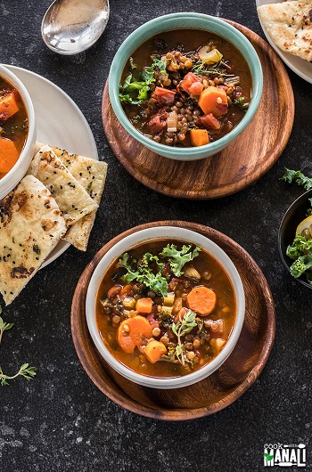

## Lentil Soup

[Original Recipe by Cook with Manali](https://www.cookwithmanali.com/vegan-lentil-soup/)

** Prep time: 15 minutes || Cook time: 30 minutes || Serving: 45 minutes || Rating 9/10 **

### Ingredients

- 2 tablespoons olive oil or avocado oil
- 1 bay leaf
3 medium carrots, 200 grams, cut into rounds
3 stalks celery, chopped
3 stalks green onion, chopped
1 medium yellow or white onion, 100 grams, diced
1 inch ginger, chopped
3 large garlic cloves, minced
14.5 oz can fire roasted tomatoes
1/2 teaspoon cumin powder, or add more to taste
1 teaspoon salt, or to taste
1/4 teaspoon cayenne pepper, or to taste
1/4 teaspoon ground black pepper, or to taste
1 cup brown lentils, 200 grams
5 cups vegetable broth or water
4-5 sprigs thyme
1.5 cups chopped kale
1 lemon, juice of 

### Instructions

1. Heat 2 tablespoons of oil in a heavy bottom pan or dutch oven. Once the oil is hot add the bay leaf. Saute for few seconds and then add the carrot, celery, green onion, white onion, ginger and garlic.

Cook the veggies for 4 to 5 minutes until softened.

Then add a can of fire roasted tomatoes and mix well. Cook for 2 minutes and then add the cumin, salt, cayenne and black pepper and cook for another minute or so.

Add the lentils and stir.

Add the broth/water and sprigs of thyme to the pot.

Mix well and let it all come to a boil. Let lower the heat to medium-low and let the soup simmer uncovered for around 25 to 30 minutes or until lentils are softened but still hold their shape.

Stir in chopped kale and let it cook for another 2 to 3 minutes.

Finally add in lemon juice, if using and mix.

Serve this vegan lentil soup with with bread/brown rice.
