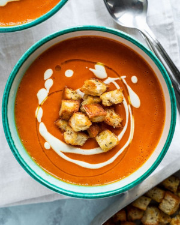

## Roasted Tomato and Red Pepper Soup

[Original Recipe](https://sixhungryfeet.com/roasted-tomato-and-red-pepper-soup/)

** Prep time: 15 minutes || Cook time: 30 minutes || Serving: 4 || Rating 10/10 **

### Ingredients

- 500g tomatoes, halves
- 1 bell red pepper, halves
- 1 medium-size sweet potato, peeled and chopped
- 1 sweet onion, quartered
- 1 garlic head
- 750 ml (3 cups) broth
- 1/2 teaspoon oregano
- 1/2 teaspoon dried basil
- salt and pepper to taste
- about 1 cup of cream (coconut cream, soy milk, almond milk, milk etc.)

### Instructions

1. Preheat the oven at 400ºF
2. Add the tomatoes, red pepper, sweet potato, onion, the garlic head into a baking tray.
3. Bake for 20-30 minutes. 
4. Transfer all the ingredients to a blender and add the broth. Blend until you have a homogeneous consistency.
5. Pour it in a pot over medium-high heat. Add herbs, salt, pepper and cream of your choice. Adjust the taste. Heat the soup until warm enough

Serve warm with croutons or crackers. 

