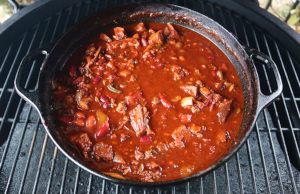

## Smoked Chili

[Original Recipe by Malcolm Reed](https://howtobbqright.com/2017/11/02/smoked-chili-recipe/#tasty-recipes-8677)

** Prep time: 20 minutes || Cook time: 4 hours and 2:30 hours || Serving: 8 || Rating X/10 **

### Smoked Chuck Roast or Brisket
### - Ingredients

- Chuck Roast or Brisket
- Chili Rub:
    - 1 Tablespoon Killer Hogs AP Rub (or All Purpose Seasoning)
    - 1 Tablespoon Chili Powder
    - 1 Tablespoon Onion Powder
    - 1 Tablespoon Cumin
    - 2 teaspoon Paprika
    - 1 teaspoon Oregano
    - 1 teaspoon Cayenne Pepper
    - 1 teaspoon Chipotle Pepper

### - Instructions

1. Bring the smoker to 250⁰. 
2. Seasons over all sides of the chuck roast or brisket with the Chili Rub. 
3. Place the roast on the smoker and let it cook for about 4 hours. The internal temp should be around 180 degrees.
	- You want it a little firm (not falling apart) because it will be cubed and simmered for several hours in the chili.

### Smoked Chili
### - Ingredients

- 4lb Smoked Chuck Roast or Smoked Brisket, cut into bite size pieces
- 1lb Spicy Hot Breakfast Sausage
- 1 Poblano Pepper, grilled and then chopped
- 1 Red Bell Pepper, grilled and then chopped
- 1 Sweet Onion, grill and then chopped
- 24oz Diced Tomatoes
- 3 Chipotle Peppers in Adobo Sauce chopped, chopped
- 3–4 cloves Fresh Garlic, minced
- 1 quart Beef Broth
- 1/4 cup Worcestershire
- 2 Tablespoons Hot Sauce
- 2 Tablespoons Tomato Paste
- 1 14oz can beans (red kidney, black, white, pinto beans) (optional)
- Chili Seasoning 
    - 1/3 cup Sugar (honey, maple, cane sugar) (optional)
    - 2 Tablespoons Killer Hogs AP Rub (or All Purpose Seasoning)
    - 2 Tablespoons Chili Powder
    - 1 Tablespoon Ground Cumin
    - 1 Tablespoon Onion Powder
    - 2 teaspoons Paprika
    - 1 teaspoon Ground Chipotle Pepper
    - 1 teaspoon Ground Ancho Chili Pepper
    - 1 teaspoon Oregano
    - 1/4 teaspoon Cayenne Pepper (more if you like it spicy)
    
### - Instructions
1. Prepare the smoker for indirect cooking at 300⁰.
2. Grill Onion, Bell Pepper, and Poblano Pepper for a few minutes on each side and chop.
2. In a 5 quart iron pot add chopped grilled vegetables, diced tomatoes, chuck roast, spicy sausage, chipotle peppers, garlic, and chili seasoning; stir to combine.
3. Add broth, hot sauce, Worcestershire sauce, and tomato paste; stir to combine.
4. Place iron pot on the smoker for 2 ½ hours stirring occasionally.
5. Add Chili Beans, stir to combine and continue cooking for 1 additional hour.
6. Adjust spices and herbs if needed. 

 Serve with your favourite toppings (shredded cheese, sour cream, fresh cilantro, lime wedges)

