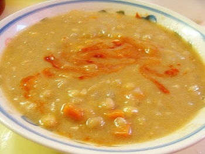

## Soupe Aux Pois Québécoise Traditionnelle Vegan (French Canadian Pea Soup)

[Original Recipe by Bryanna Clark Grogan](http://veganfeastkitchen.blogspot.com/2013/02/homemade-habitant-pea-soup-soupe-aux.html)

** Cook time: 2 hours || Serving: 6-8 || Rating 9.5/10 **

### Ingredients

- 2 cups dried whole yellow peas
- 8 cups vegetarian broth
- 1 large onion, chopped
- 2 medium carrots, scrubbed and diced small
- 1/2 cup chopped celery (with leaves)
- 2 cloves garlic, crushed
- 2 tablespoons chopped parsley
- 1 bay leaf
- 1/2 teaspoon ground allspice  
- salt and freshly-ground black pepper to taste
- 1 teaspoon liquid smoke 
- 1 tablespoon smoked tofu bits (optional)
- 1 tablespoon dark sesame oil  

### Instructions

1. Soak the peas in water to cover generously  for about 8 hours, then drain.
2. Mix the soaked peas in a large heavy pot with the broth, vegetables, herbs and spices, liquid smoke, optional smoked tofu, and sesame oil.  Simmer for 2 hours.  
3. With a immersion blender, blend just enough to puree some of the peas, about half.  Just pulse briefly around the pot (or take out half of the peas and pulse it in a different pot).
4. Taste to adjust seasonning of necessary. 

Serve hot with crusty bread.

